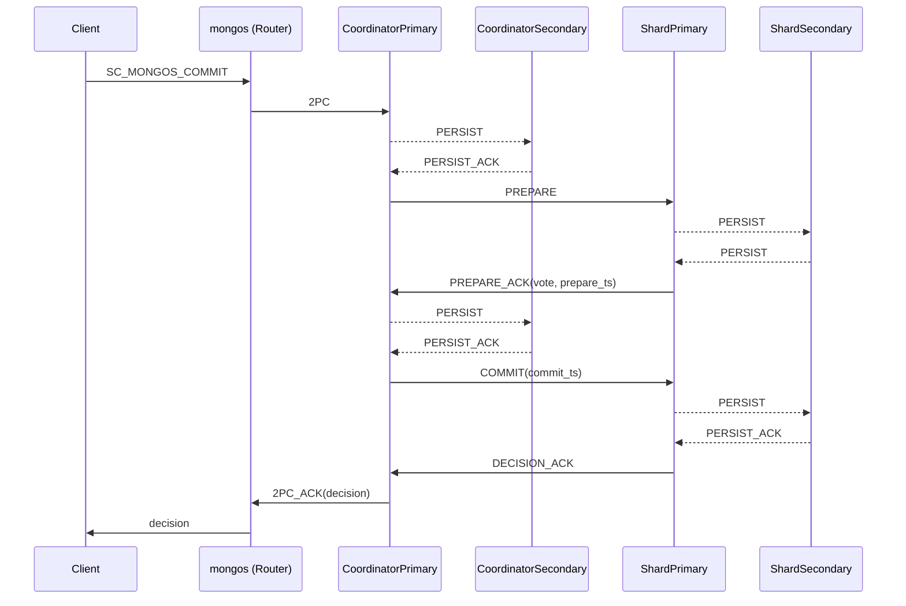

```mermaid
sequenceDiagram
	participant Client
	participant mongos (Router)
	participant CoordinatorPrimary
	participant CoordinatorSecondary
	participant ShardPrimary
	participant ShardSecondary

	Client ->> mongos (Router): SC_MONGOS_COMMIT

	mongos (Router) ->> CoordinatorPrimary: 2PC

	CoordinatorPrimary -->> CoordinatorSecondary: PERSIST
	CoordinatorSecondary -->> CoordinatorPrimary: PERSIST_ACK

	CoordinatorPrimary ->> ShardPrimary: PREPARE
	ShardPrimary -->> ShardSecondary: PERSIST
	ShardSecondary -->> ShardPrimary: PERSIST
	ShardPrimary ->> CoordinatorPrimary: PREPARE_ACK(vote, prepare_ts)

	CoordinatorPrimary -->> CoordinatorSecondary: PERSIST
	CoordinatorSecondary -->> CoordinatorPrimary: PERSIST_ACK
	CoordinatorPrimary ->> ShardPrimary: COMMIT(commit_ts)
	ShardPrimary -->> ShardSecondary: PERSIST
	ShardSecondary -->> ShardPrimary: PERSIST_ACK
	ShardPrimary ->> CoordinatorPrimary: DECISION_ACK
	CoordinatorPrimary ->> mongos (Router): 2PC_ACK(decision)
	mongos (Router) ->> Client: decision
```